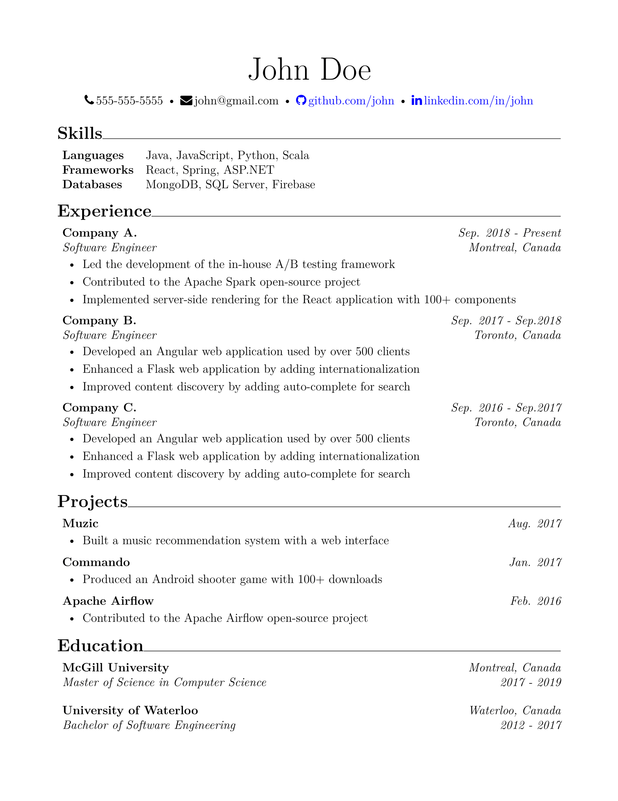

# simple-resume
A simple LaTeX resume template inspired by [Awesome CV](https://github.com/posquit0/Awesome-CV).

### Example
> 

## Requirements
- [TeX Live](https://www.tug.org/texlive/)

## Usage
- Modify the `resume.tex` file with your data
- Run `xelatex resume.tex` in the project directory or use your favorite TeX editor to build the pdf
